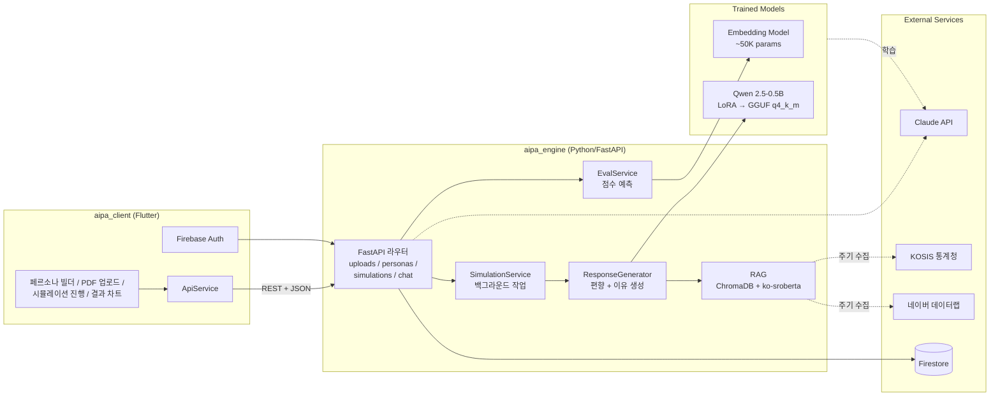
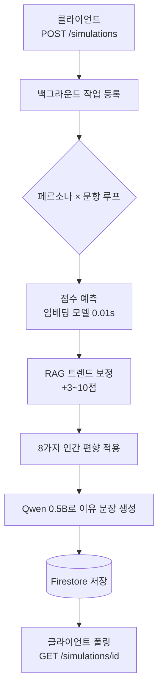

# AIPA Engine — AI 페르소나 기반 설문 시뮬레이션 서버
> 설문지 PDF를 업로드하면 AI 가상 패널이 실제 사람처럼 응답하고 통계 리포트를 생성하는 시뮬레이션 플랫폼의 **서버 측 레포지토리**입니다.
>
> Claude API로 합성 학습 데이터를 만들어 **자체 경량 점수 예측 모델(~50K params)** 과 **Qwen 2.5-0.5B LoRA 파인튜닝 LLM** 을 학습해, 외부 API 의존성 없이 시뮬레이션이 동작합니다.


> 🔗 **Sister Repo (Client)**: [aipa_client (Flutter 모바일 앱)](https://github.com/junHyeong7083/aipa_client)
> 두 레포가 합쳐 **풀스택 시스템** 을 구성합니다.

---

## 📌 At a Glance

| 항목 | 내용 |
|------|------|
| **기간** | 2026.01 ~ 진행 중 (예비창업패키지 제안 프로젝트) |
| **팀** | **1인 개발** (서버 + 클라이언트 + 모델 학습 + 클라우드 배포 전 영역) |
| **본인 역할** | AI 모델 학습 / FastAPI 백엔드 / Flutter 앱 / GCP Cloud Run 배포 |
| **본 레포 범위** | **서버 (aipa_engine)** — AI 모델 학습, 추론 서비스, FastAPI, Cloud Run 배포 |
| **자매 레포** | [aipa_client](https://github.com/junHyeong7083/aipa_client) (Flutter 모바일 앱) |
| **AI 모델** | 자체 점수 예측 모델 (~50K params) + Qwen 2.5-0.5B QLoRA |
| **학습 데이터** | Claude API로 생성한 4,327건 합성 데이터 (Knowledge Distillation) |
| **배포** | GCP Cloud Run + Firestore + Firebase Auth |

---

## ✨ Highlights

- **Knowledge Distillation**: Claude API의 판단 능력을 4,327건 합성 데이터로 추출 → 자체 경량 모델 학습
- **자체 점수 예측 모델**: 약 50,000개 파라미터, 평균 오차 8.7점, **추론 0.01초** (CPU)
- **QLoRA 파인튜닝**: Qwen 2.5-0.5B를 NF4 4bit + LoRA r=16으로 효율적 파인튜닝 (전체 파라미터의 ~1%만 학습)
- **GGUF 변환 + Cloud Run CPU**: 0.5B 모델을 q4_k_m으로 양자화(~300~400MB), 서버리스 환경에서 1~2초 이유 생성
- **RAG 트렌드 보정**: ChromaDB + ko-sroberta + 네이버 데이터랩/KOSIS로 학습 시점 이후 트렌드 반영
- **8가지 인간 응답 편향**: 극단 회피·묵종·사회적 바람직성·피로 효과 등으로 AI 특유의 "완벽한 응답" 회피
- **3단계 폴백**: 자체 0.5B → Claude API → 템플릿 — 외부 API 다운에도 핵심 시뮬레이션 100% 동작
- **비용 0원화**: 기존 LLM 호출당 ~$0.5 비용을 자체 모델로 제거 (월 1,000회 사용 시 약 70만원 절감)

---

## 🏗 Architecture

### 풀스택 시스템 구성



### 시뮬레이션 파이프라인



---

## 🛠 How It Works

### 1. Knowledge Distillation — 합성 학습 데이터 4,327건 생성

실제 패널 모집 비용을 회피하기 위해, Claude API에 "이 페르소나가 이걸 보면 어떻게 평가할까?"를 4,327번 질문해 정답 데이터를 모았습니다.

- 16개 카테고리 × 124개 자극물(제품/광고/정책 시나리오)
- 40명의 페르소나 (10대~60대, 남녀, 직업 20종)
- 50개 평가축 (호감도, 구매의향, 가격적절성 등)
- 비용: ~$37 (1회성 → 이후 자체 모델로 무제한 추론)

```python
async def evaluate(persona, stimulus, axes):
    prompt = f"""당신은 소비자 반응 평가 전문가입니다.
[자극물] 유형: {stimulus.type} / 내용: {stimulus.text}
[페르소나] {persona.age} {persona.gender} {persona.job}
           특성: {', '.join(persona.traits)}
[평가축] {', '.join(axes)}
각 축에 0-100점과 근거를 JSON으로 응답하세요."""

    response = await claude.messages.create(
        model="claude-sonnet-4-20250514",
        max_tokens=600,
        messages=[{"role": "user", "content": prompt}],
    )
    return parse_evaluation(response.content)
```

### 2. 자체 점수 예측 모델 (PyTorch)

페르소나 속성(연령·성별·직업·특성 × 5)을 nn.Embedding으로 벡터화 + Attention으로 특성 가중합. 약 **50,000 파라미터** (Qwen 7B의 1/140,000), **추론 0.01초**, 모델 크기 ~1MB.

```python
class PersonaEmbeddingModel(nn.Module):
    def __init__(self, embed_dim=24, hidden_dim=64):
        super().__init__()
        self.age_embed        = nn.Embedding(6,  embed_dim)
        self.gender_embed     = nn.Embedding(3,  embed_dim // 2)
        self.occupation_embed = nn.Embedding(44, embed_dim)
        self.trait_embed      = nn.Embedding(90, embed_dim)
        self.category_embed   = nn.Embedding(16, embed_dim)
        self.axis_embed       = nn.Embedding(50, embed_dim)

        self.trait_attention  = nn.Linear(embed_dim, 1)
        self.persona_encoder  = nn.Sequential(
            nn.Linear(84, hidden_dim), nn.ReLU(), nn.Dropout(0.2),
            nn.Linear(hidden_dim, embed_dim))
        self.predictor = nn.Sequential(
            nn.Linear(48, 64), nn.ReLU(), nn.Dropout(0.2),
            nn.Linear(64, 32), nn.ReLU(),
            nn.Linear(32, 1),  nn.Sigmoid())

    def forward(self, age, gender, occ, traits, cat, axis):
        trait_vecs    = self.trait_embed(traits)               # (B, 5, D)
        trait_weights = torch.softmax(
            self.trait_attention(trait_vecs), dim=1)            # (B, 5, 1)
        trait_vec     = (trait_vecs * trait_weights).sum(dim=1) # (B, D)
        # ... persona/context 인코딩 후 결합
        return self.predictor(combined).squeeze(-1)             # 0~1
```

**결과**: 평균 예측 오차 **8.7점** (100점 만점), 추론 **0.01초** (CPU).

### 3. Qwen 2.5-0.5B QLoRA 파인튜닝 — 이유 문장 생성

역할 분리:
- 임베딩 모델: 점수만 0.01초에 예측
- 0.5B LoRA 모델: 그 점수에 대한 "왜 그런가" **이유 문장만** 생성 (점수 결정에는 관여 X)

```python
bnb_config = BitsAndBytesConfig(
    load_in_4bit=True,
    bnb_4bit_quant_type="nf4",
    bnb_4bit_compute_dtype=torch.bfloat16,
    bnb_4bit_use_double_quant=True,
)

model = AutoModelForCausalLM.from_pretrained(
    "Qwen/Qwen2.5-0.5B-Instruct",
    quantization_config=bnb_config,
    device_map="auto",
)

# LoRA 어댑터 (전체 파라미터의 ~1%만 학습)
lora_config = LoraConfig(
    r=16, lora_alpha=32, lora_dropout=0.05,
    bias="none", task_type="CAUSAL_LM",
    target_modules=["q_proj", "k_proj", "v_proj", "o_proj",
                    "gate_proj", "up_proj", "down_proj"],
)
model = get_peft_model(prepare_model_for_kbit_training(model), lora_config)
```

### 4. 배포 최적화: GGUF + Cloud Run CPU

- LoRA 어댑터 + 베이스 모델 병합(`merge_and_unload`)
- llama.cpp 호환 GGUF q4_k_m 양자화 → 약 **300~400MB**
- Cloud Run CPU 환경에서 1~2초에 이유 생성

### 5. RAG 트렌드 보정 (ChromaDB)

학습 시점 이후 트렌드를 반영하기 위해 네이버 데이터랩 · KOSIS 데이터를 ChromaDB로 관리.

```python
def _get_trend_adjustment(self, request):
    query   = f"{request.stimulus_type.value} {request.stimulus[:50]}"
    results = self._rag.search_trends(query, n_results=3)
    docs    = results.get("documents", [[]])[0]
    if not docs: return {}

    trend_count = len(docs)
    base_boost  = min(trend_count * 3, 10)

    trend_text  = " ".join(docs).lower()
    positive    = sum(1 for k in ["증가", "상승", "인기", "성장"] if k in trend_text)
    negative    = sum(1 for k in ["감소", "하락", "위축", "부진"] if k in trend_text)
    sentiment   = (positive - negative) * 2

    return {axis: base_boost + sentiment
            for axis in ["호감도", "구매의향", "관심도", "사용의향",
                         "참여의향", "클릭의향", "추천의향"]}
```

### 6. 인간 응답 편향 시뮬레이션 (8종)

- **극단 회피** (한국인 특성, 중간 선호)
- **묵종 편향** ("그렇다" 동의 경향)
- **사회적 바람직성** (환경/건강에 더 긍정)
- **피로 효과** (설문 후반 같은 답 반복)
- **무응답** (소득/정치 민감 질문 스킵)
- **또래 효과** (같은 연령대 응답 수렴)
- **시간대 효과** (야간 충동, 월요일 부정)
- **응답 노이즈** (같은 사람도 ±5~10점 변동)

연령대별 가중치 예시:

```python
AGE_RESPONSE_TRAITS = {
    AgeGroup.TEENS: {
        "central_tendency":     0.15,
        "acquiescence":         0.25,
        "social_desirability":  0.30,
        "straight_lining":      0.10,
    },
    AgeGroup.FIFTIES: {
        "central_tendency":     0.45,
        "acquiescence":         0.50,
        "social_desirability":  0.55,
        "straight_lining":      0.35,
    },
}
```

### 7. 3단계 폴백 (Multi-stage Fallback)

이유 생성:
1. 자체 0.5B 모델 (무료, CPU)
2. Claude API (실패 시 유료 폴백)
3. 템플릿 (둘 다 실패 시 고정 문장)

점수는 임베딩 모델이 이미 확정 → 이유 생성이 실패해도 **핵심 기능은 100% 동작**.

---

## 🚀 Getting Started

### 환경

- Python 3.11
- (선택) GPU — 학습 시 권장. 추론은 CPU로 충분
- GCP 계정 (Cloud Run 배포 시)

### 로컬 실행

```bash
# 의존성 설치
pip install -e .

# 환경변수 설정 (.env)
# CLAUDE_API_KEY=...
# GOOGLE_APPLICATION_CREDENTIALS=./serviceAccountKey.json

# 서버 실행
uvicorn aipa_engine.main:app --host 0.0.0.0 --port 8080

# 또는 PowerShell 헬퍼
./start_server.ps1
```

### 모델 학습

```bash
# 합성 학습 데이터 생성 (Claude API 필요)
python training/build_real_dataset.py

# 임베딩 모델 학습
python training/train_embedding.py

# Qwen 0.5B QLoRA 파인튜닝 (GPU 필요)
python training/train_reasoning.py

# GGUF 변환 (배포용)
python training/convert_gguf.py
```

### Cloud Run 배포

```bash
docker build -t aipa-engine .
gcloud run deploy aipa-engine \
    --image=gcr.io/<PROJECT>/aipa-engine \
    --region=asia-northeast3 \
    --memory=4Gi --cpu=2 \
    --no-cpu-throttling --min-instances=1 --max-instances=3
```

자세한 배포 가이드는 [`DEPLOY.md`](DEPLOY.md) 참고.

---

## 📂 Project Structure

```
aipa_engine/
├── src/aipa_engine/
│   ├── main.py                    # FastAPI app
│   ├── api/                       # 라우터 (uploads, personas, simulations, chat)
│   └── services/
│       ├── eval_service.py        # 점수 예측 (+ RAG 보정)
│       ├── simulation_service.py  # 백그라운드 시뮬레이션
│       └── response_generator.py  # 인간 편향 + 이유 생성
│
├── training/                      # 모델 학습 스크립트
│   ├── build_real_dataset.py      # Claude API로 합성 데이터 생성
│   ├── train_embedding.py         # 점수 예측 모델 학습
│   ├── train_reasoning.py         # QLoRA 파인튜닝
│   ├── convert_gguf.py            # GGUF q4_k_m 변환
│   └── models/                    # 학습된 가중치
│
├── rag/                           # ChromaDB + ko-sroberta 트렌드
├── data/                          # 원본·정제 데이터
├── scripts/                       # 운영/배포 헬퍼
├── tests/                         # 테스트
├── Dockerfile                     # Cloud Run 빌드
├── DEPLOY.md                      # 배포 가이드
├── pyproject.toml
└── README.md
```

---

## 🧠 Applied Patterns

| 패턴 | 사용처 |
|------|--------|
| **Knowledge Distillation** | Claude의 판단 능력을 4,327건 합성 데이터로 추출하여 경량 모델 학습 |
| **QLoRA Fine-tuning** | Qwen 2.5-0.5B를 NF4 4bit + LoRA r=16으로 효율적 파인튜닝 |
| **Multi-stage Fallback** | 자체 0.5B → Claude API → 템플릿 3단계 폴백 |
| **RAG** | ChromaDB + ko-sroberta로 트렌드 검색 → 점수 보정 |
| **Service Layer** | EvalService, SimulationService, ResponseGenerator 책임 분리 |
| **Stateless API + Background Task** | Cloud Run에서 시뮬레이션을 background task로 비동기 실행, 폴링으로 결과 조회 |

---

## 🧪 Lessons Learned

- Knowledge Distillation으로 대형 모델 비용 없이 도메인 특화 경량 모델 제작 가능함을 검증
- 임베딩 레이어를 쓴다고 모두 "임베딩 모델"이 아니며, **출력이 벡터인지 스칼라인지**로 정확히 명명해야 함
- QLoRA + GGUF 파이프라인으로 0.5B 모델을 CPU 환경에 실배포 가능
- AI 응답을 그대로 쓰지 않고 **명시적 인간 편향 모델**을 덧붙여야 현실에 가까운 시뮬레이션이 됨
- Cloud Run의 CPU throttling, cold start, 5분 TTL 캐시 등 서버리스 운영 트레이드오프 학습
- Flutter ↔ FastAPI ↔ PyTorch 모델까지 풀스택 1인 개발 일정/우선순위 관리 경험

---

## 🔗 Links

- 📖 **Portfolio**: https://junhyeong7083.github.io/PortFolio/portfolio/aipa
- 📦 **Client Repo**: https://github.com/junHyeong7083/aipa_client (Flutter 모바일 앱)
- 📄 [`DEPLOY.md`](DEPLOY.md) — Cloud Run 배포 가이드
